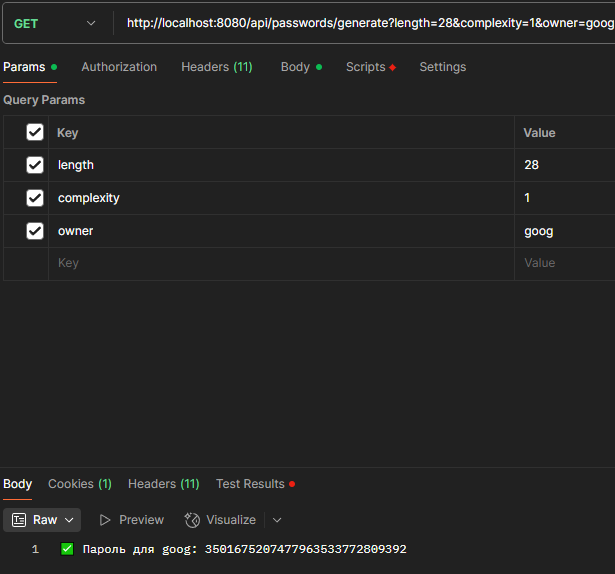

Веб-приложение для генерации и управления паролями с тегами. Использует PostgreSQL, BCrypt для шифрования, Spring Security для доступа, кэширование и CRUD-операции.

1. Добавить сервис для подсчёта обращений к основному сервису. Счётчик должен быть реализован в виде отдельного класса, доступ к которому должен быть синхронизирован.
2. Используя jmeter/postman или любые другие средства сконфигурировать нагрузочный тест и убедиться, что счётчик обращений работает правильно при большой нагрузке.
# Generate-bulk
 

# Generate solo password
 